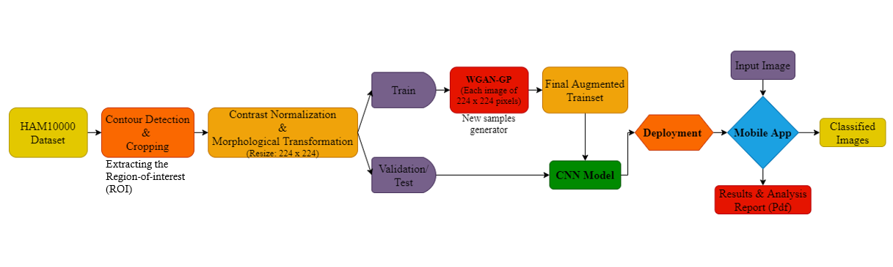
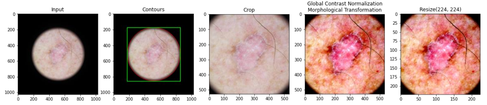
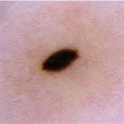
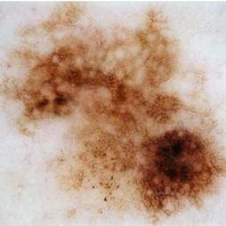
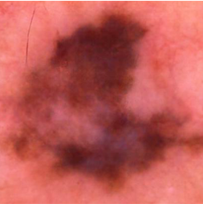
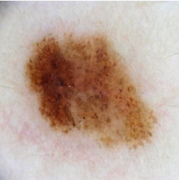
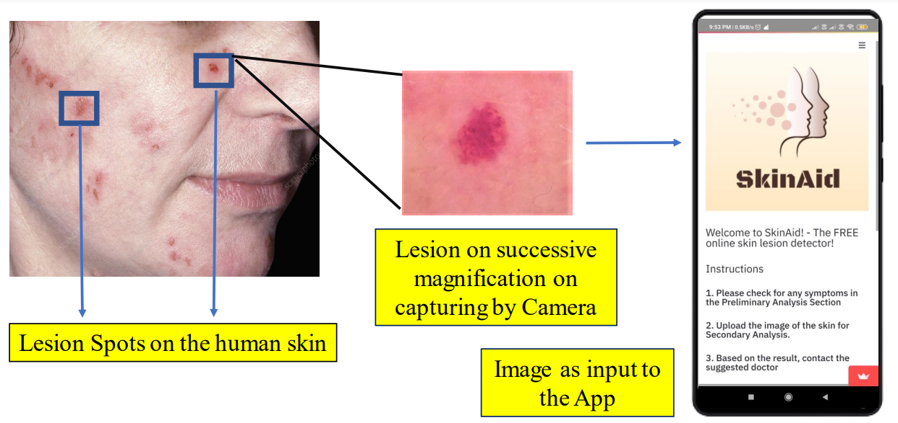
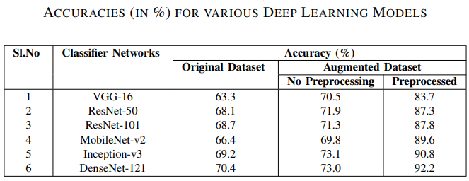

# SkinAid: A GAN-based Automatic Skin Lesion Monitoring Method for IoMT Frameworks

This is the official W-GAN code release of our paper:
#### Submitted for IEEE OITS International Conference on Information Technology, December-2021

###  Overview:

• Extracted the Region-of-interest of the Skin Lesions (Melanoma, Melanocytic Nevi, Benign Keratosis, Basal Cell Carcinoma, Actinic Keratosis, Vascular Lesions & Dermatofibroma) & pre-processing. 
 
• Enhanced the highly unbalanced & limited HAM10000 dataset by augmenting/generating synthetic Skin Lesion images using Wasserstein-GAN with Gradient penalty. 
 
• Trained our model to classify 7 types skin cancers/lesions using Transfer learning (ResNet, EfficientNet, DenseNet, MobileNet) and achieved a best accuracy of 92.2% with DenseNet-121. 
 
• Developed a prototype of an Android Application to capture real-time skin lesion image from smartphone camera to detect, classify & generate a preliminary analysis report, useful in rural or remote areas with limited healthcare access. 

### (a) Extracting the Region-of-interest:

 

### (b) Samples of Synthetic Images Generated using Wassetstein GAN:
   

 

### (c) Training CNN models with Transfer Learning & Smartphone Deployment:

 

